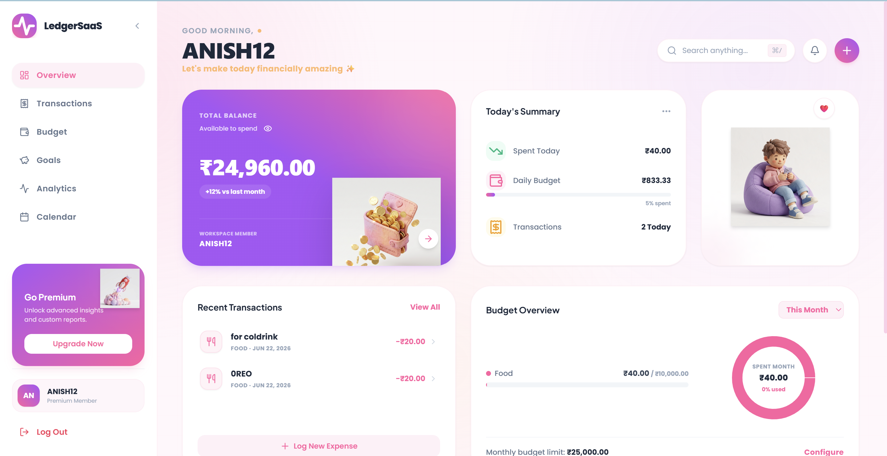
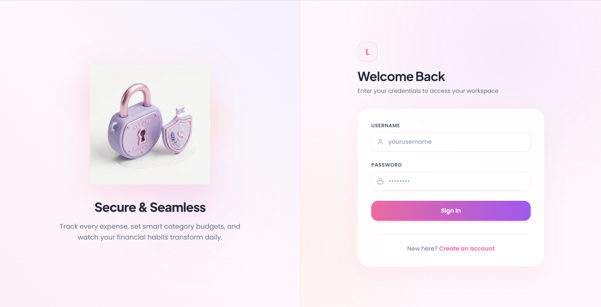
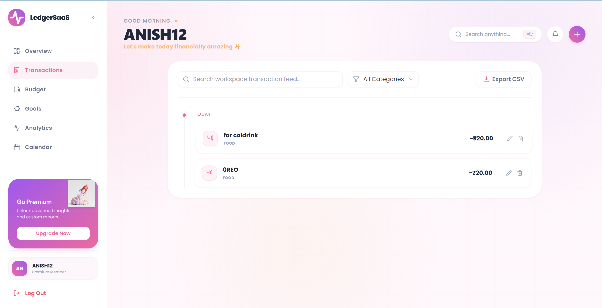

# 💸 LedgerSaaS
### Modern Personal Finance & Expense Management Platform

Track expenses, manage budgets, monitor savings goals, and gain intelligent financial insights through a beautifully designed user experience.

</div>

---

## ✨ Overview

LedgerSaaS is a modern full-stack expense management platform designed to help users understand and optimize their spending habits.

Unlike traditional expense trackers, LedgerSaaS focuses on:

- Smart financial insights
- Budget planning
- Savings tracking
- Interactive analytics
- Personalized financial recommendations
- Modern user experience

The application combines powerful expense management tools with a premium fintech-inspired interface.

---

## 🚀 Features

### 💰 Expense Management

- Add expenses
- Edit expenses
- Delete expenses
- Categorize transactions
- Search expenses
- Filter by category

### 📊 Budget Tracking

- Monthly budget management
- Category-wise spending limits
- Budget utilization tracking
- Remaining balance calculations

### 🎯 Savings Goals

- Create savings targets
- Progress tracking
- Milestone monitoring
- Goal completion analytics

### 🧠 Smart Insights

- Spending pattern analysis
- Top spending categories
- Budget health indicators
- Personalized recommendations

### 🔒 Authentication & Security

- JWT Authentication
- Secure login system
- User registration
- Protected routes
- Session persistence

### 📱 Modern User Experience

- Responsive design
- Mobile-friendly interface
- Smooth animations
- Interactive dashboards
- Dark/Light mode support

---

## 🖼️ Screenshots

### Dashboard


### Login




### Transactions



---

## 🏗️ System Architecture

```text
Frontend (React)
        │
        ▼
REST APIs
        │
        ▼
Spring Boot Backend
        │
        ▼
PostgreSQL Database
```

---

## ⚙️ Tech Stack

### Frontend

- React
- React Router
- Axios
- Tailwind CSS / Custom CSS
- Framer Motion
- Recharts

### Backend

- Java 21
- Spring Boot
- Spring Security
- Spring Data JPA
- JWT Authentication

### Database

- PostgreSQL

### Tools

- Maven
- Git
- GitHub
- Postman
- VS Code
- IntelliJ IDEA

---

## 📂 Project Structure

```text
LedgerSaaS/
│
├── frontend/
│   ├── src/
│   ├── components/
│   ├── pages/
│   ├── services/
│   └── assets/
│
├── backend/
│   ├── controller/
│   ├── service/
│   ├── repository/
│   ├── entity/
│   ├── dto/
│   ├── config/
│   └── security/
│
└── database/
```

---

## 🔑 Environment Variables

### Backend

```env
DB_URL=jdbc:mysql://localhost:3306/ledgerdb
DB_USERNAME=root
DB_PASSWORD=yourpassword

JWT_SECRET=your_secret_key
JWT_EXPIRATION=86400000
```

### Frontend

```env
VITE_API_URL=http://localhost:8080/api
```

---

## 🛠️ Installation

### Clone Repository

```bash
git clone https://github.com/yourusername/ledgersaas.git
cd ledgersaas
```

---

## Backend Setup

```bash
cd backend
mvn clean install
mvn spring-boot:run
```

Backend runs on:

```text
http://localhost:8080
```

---

## Frontend Setup

```bash
cd frontend
npm install
npm run dev
```

Frontend runs on:

```text
http://localhost:5173
```

---

## 🔐 Authentication Flow

```text
User Login
    │
    ▼
JWT Generated
    │
    ▼
Stored in Local Storage
    │
    ▼
Included in API Requests
    │
    ▼
Backend Validation
```

---

## 📊 Core Modules

### Dashboard

Provides:

- Financial overview
- Budget summary
- Spending statistics
- Smart insights

### Transactions

Provides:

- Expense tracking
- Search & filtering
- Transaction management

### Budget Management

Provides:

- Budget creation
- Budget monitoring
- Spending alerts

### Savings Goals

Provides:

- Goal creation
- Progress visualization
- Achievement tracking

---

## 🚀 Future Enhancements

- AI Financial Advisor
- Receipt OCR Scanner
- Multi-Currency Support
- PDF Report Generation
- Email Reports
- Subscription Tracking
- Recurring Expenses
- Expense Forecasting
- Investment Tracking
- Bank Account Integration

---

## 🧪 Testing

Run backend tests:

```bash
mvn test
```

Run frontend checks:

```bash
npm run build
```

---

## 🤝 Contributing

Contributions are welcome.

1. Fork the repository
2. Create feature branch

```bash
git checkout -b feature/new-feature
```

3. Commit changes

```bash
git commit -m "Add new feature"
```

4. Push

```bash
git push origin feature/new-feature
```

5. Create Pull Request

---

## 👨‍💻 Author

### Anish Kumar Mishra

B.Tech CSE | Full Stack Developer

📧 anish.k.m2005@gmail.com

🔗 LinkedIn: www.linkedin.com/in/anish-kumar-mishra

🔗 GitHub: github.com/anishmishra

---

## ⭐ Support

If you found this project useful:

⭐ Star the repository

🍴 Fork the repository

📢 Share with others

---


Built with ❤️ by Anish Kumar Mishra
